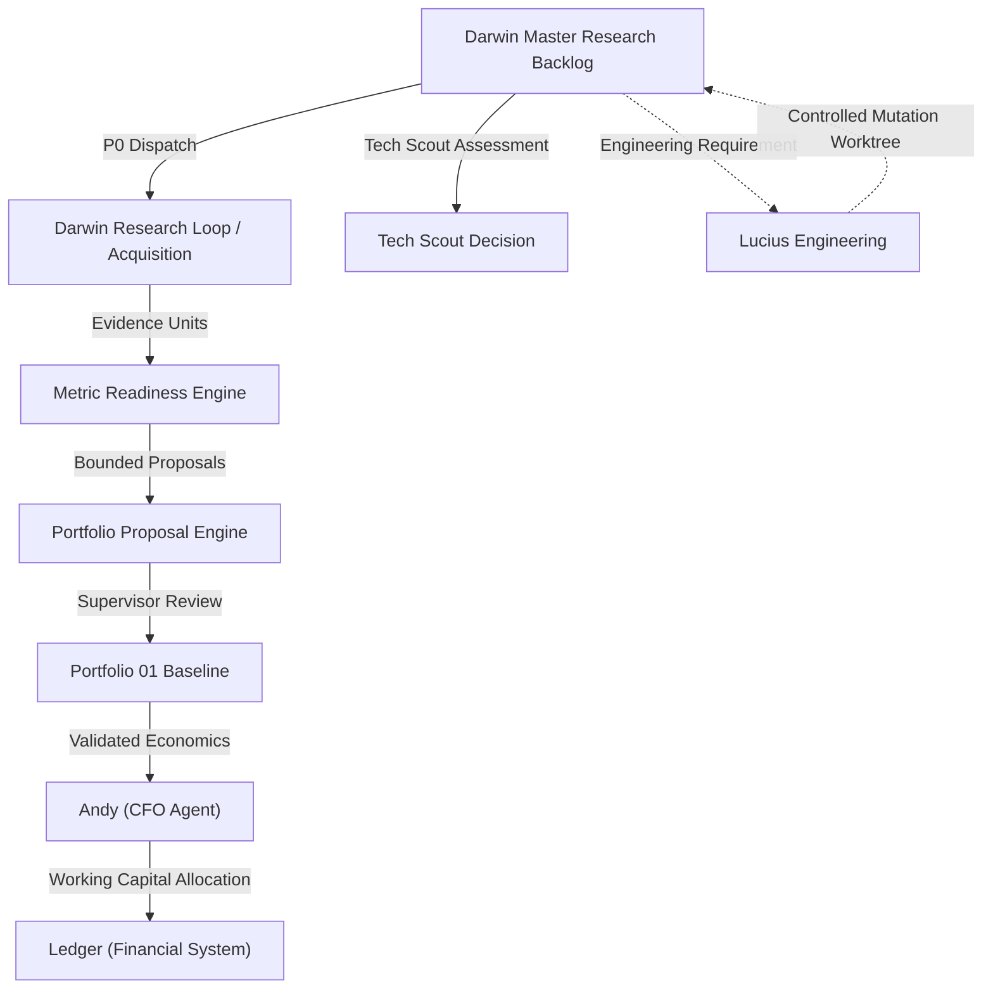

# Darwin Master Research Backlog

## 1. Overview & Purpose

The **Darwin Master Research Backlog** is the unified, durable registry for all research, intelligence-gathering, business validation, technology scouting, and capability development across Daniel / DFG.

Darwin is primarily an operational intelligence and research engine. To prevent fragmentation across ad-hoc chat conversations or disconnected files, all known research items are registered in a single canonical backlog with deterministic schemas and explicit provenance tracking.

---

## 2. Taxonomy & Work Classes

The backlog classifies all work into four mutually exclusive categories:

1. **`MONETIZATION`**: Concrete economic opportunities Darwin evaluates for DFG (e.g., equipment rental, external engineering services, commercial photography).
   * *Rule*: All monetization items link directly to their corresponding canonical Portfolio 01 opportunity ID (`related_opportunity_id`). They never duplicate economic records or impute numbers.
2. **`BUSINESS_VALIDATION`**: Business concepts requiring structured market, workflow, customer, or economic validation before commitment (e.g., Locations Concierge, DealHunter).
3. **`TECHNOLOGY_SCOUT`**: External open-source repositories, developer tools, libraries, APIs, or SaaS products evaluated for DFG leverage (e.g., Scrapling, Vibe-Trading, DefiLlama).
4. **`INTELLIGENCE_CAPABILITIES`**: Specialized research, data processing, and analytics capabilities that Darwin itself may eventually provide (e.g., prediction market feeds, on-chain flows, derivatives surveillance).

---

## 3. Priority Model

Backlog priorities represent **current DFG execution importance**, not generic technological attractiveness or subjective interest.

* **`P0_NOW`**: Immediate execution priority. Unblocks near-term cash flow or primary dependencies.
* **`P0`**: Core high-importance priority for the current operational shift.
* **`P1_HIGH`**: High-priority near-term item with imminent strategic value.
* **`P1`**: Secondary active queue priority.
* **`P1_P2`**: Intermediate evaluation priority.
* **`P2`**: Backlog item queued for future capacity.
* **`P2_LATER`**: Long-term capability research.
* **`PARKED`**: Inactive item preserved for historical provenance but excluded from active dispatch.
* **`REJECTED`**: Formally evaluated and rejected.

Priority is governed by the DFG global objective: **Time-to-First-Dollar, net repeatable revenue, Daniel-hours minimization, capital efficiency, risk mitigation, and reuse of existing DFG capabilities**. Unmeasured economic metrics remain explicitly unpopulated (`None`).

---

## 4. Lifecycle & Dispatch Rules

### Status Vocabulary
* `QUEUED`: Stored in backlog, awaiting prioritization or prerequisites.
* `READY`: Eligible for immediate autonomous dispatch.
* `IN_PROGRESS`: Actively executing research or evaluation.
* `NEEDS_EVIDENCE`: Blocked by missing empirical data or market benchmarks.
* `NEEDS_OPERATOR_INPUT`: Requires specific Daniel input (inventory, capacity, credentials).
* `BLOCKED`: Gated by an upstream dependency or external constraint.
* `COMPLETED`: Research packet or assessment delivered.
* `PARKED`: Retained for provenance without active execution.
* `REJECTED`: Excluded from execution.

### Dispatch Invariants
1. An item cannot have status `READY` if `blocked_by` is non-empty.
2. An item cannot have status `READY` or `IN_PROGRESS` if priority is `PARKED` or `REJECTED`.
3. Monetization items link to Portfolio 01; they never mutate Portfolio fields automatically.

---

## 5. Technology Scout Decision Vocabulary

Technology Scout items investigate external tools against 18 structured criteria (license, maturity, architecture, programmatic access, privacy, self-hosting, overlap, maintenance, etc.) and conclude with exactly one canonical decision:

* **`USE`**: Adopt directly without modification.
* **`USE_BEHIND_ADAPTER`**: Wrap behind an isolated Darwin/DFG adapter boundary to insulate core systems from external churn.
* **`FORK_ADAPT`**: Fork the upstream codebase and maintain an internal modified version.
* **`REIMPLEMENT`**: Implement the capability from scratch using DFG architectural standards.
* **`COPY_ARCHITECTURAL_PATTERN`**: Adopt the architectural pattern or design concept without using the upstream code.
* **`STUDY_ONLY`**: Archive as reference material; no implementation authorized.
* **`REJECT`**: Incompatible, unmaintained, high risk, or redundant.

---

## 6. System Boundaries & Handoffs

* **Darwin vs. Lucius**: Darwin generates research, bounds economic ranges, audits technologies, and specifies requirements. Lucius performs controlled, supervised code mutations in isolated worktrees.
* **Darwin vs. Portfolio 01**: The Master Backlog holds the comprehensive queue of 44+ research targets across 4 classes; Portfolio 01 holds the 12 canonical monetization opportunities. Backlog monetization items link to Portfolio opportunities.
* **Darwin vs. Andy & Ledger**: Darwin provides evidence-backed opportunity economics to Andy (CFO Agent). Andy evaluates working capital, budget affordability, liquidity, and tax reserves within Ledger (the DFG financial data system). Darwin never executes payments, balances accounts, or books transactions.
