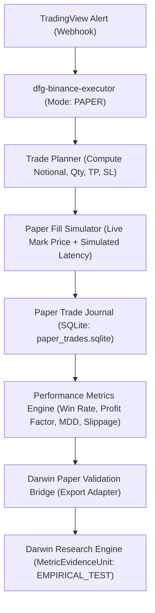

# Trading Strategy Paper Validation Engineering Specification

## Executive Summary
This document specifies the architecture and implementation requirements for the **Darwin Paper Validation Bridge** connecting DFG's Trading Infrastructure (`dfg-binance-executor` and `fpcc-trade-dashboard`) to the Darwin Research Engine.

The current code audit confirms the status **`PAPER_NOT_READY`**: while the Trade Executor has functional webhook alert ingestion, symbol validation, leverage setting, and live order placement, it lacks the critical statistical measurement, latency/slippage tracking, fee accounting, and equity curve mechanics necessary for empirical forward validation without capital risk.

---

## 1. Codebase Audit: Current vs Missing Components

Direct code-level inspection of `/Volumes/BLACKBOX/2 CODE PROJECTS/Trade Executor/dfg-binance-executor` and `/Volumes/BLACKBOX/2 CODE PROJECTS/Trading Dashboard/fpcc-trade-dashboard` reveals the following status across the 12 core dimensions:

| Component | Code Location / Status | Current Behavior | Gap Analysis | Classification |
|---|---|---|---|---|
| **Signal Price** | `alertProcessor.js:72` | Regex parsed from TradingView alert message (`priceParsed`) | Millisecond signal receipt timestamping is absent; fallback to `markPrice` occurs silently | **MUST_HAVE_FOR_PAPER_VALIDATION** |
| **Fill Price** | `binance.js:450` | `waitForPosition` queries `/fapi/v2/positionRisk` | Returns aggregate position entry price, not the fill price of the specific market order | **MUST_HAVE_FOR_PAPER_VALIDATION** |
| **Latency** | Absent | None | End-to-end execution latency (alert arrival -> order submission -> fill confirmation) is unmeasured | **MUST_HAVE_FOR_PAPER_VALIDATION** |
| **Slippage** | Absent | None | Absolute dollar and basis point (bps) slippage between signal price and execution fill is never computed | **MUST_HAVE_FOR_PAPER_VALIDATION** |
| **Fees** | Absent | None | Round-trip taker fees (~0.08%–0.10% notional on Binance Futures VIP0) are completely ignored | **MUST_HAVE_FOR_PAPER_VALIDATION** |
| **Realized PnL** | `alertProcessor.js:112` | String detection ("WIN", "LOSS", "BREAKEVEN") | No dollar calculation, no fee deductions, no percentage return on margin | **MUST_HAVE_FOR_PAPER_VALIDATION** |
| **Equity Curve** | Absent | None in Executor; simulated balance in Dashboard | No continuous mark-to-market or closed-trade equity curve tracking | **MUST_HAVE_FOR_PAPER_VALIDATION** |
| **Drawdown** | Absent | None | Peak equity, current drawdown %, and maximum drawdown (MDD) are not calculated | **MUST_HAVE_FOR_PAPER_VALIDATION** |
| **Profit Factor** | Absent | None | Gross profits divided by gross losses is uncalculated | **MUST_HAVE_FOR_PAPER_VALIDATION** |
| **Position Sizing** | `tradePlanner.js:93` | Fixed margin amount (`TRADE_USDT_AMOUNT=100`) * leverage (`BINANCE_LEVERAGE=5`) | Static fixed-dollar sizing only; no ATR-based or equity % volatility scaling | **NICE_TO_HAVE** (Static is sufficient for v0) |
| **Risk Controls** | `cooldowns.js`, `tradePlanner.js:135` | SL/TP validation, spam and bot loss cooldowns | Daily cumulative loss circuit breaker and aggregate portfolio exposure limit missing | **NICE_TO_HAVE** (Must have for live capital) |
| **Export to Darwin**| Absent | None | Zero integration between trade execution journal and Darwin's `EvidenceIntakeAdapter` | **MUST_HAVE_FOR_PAPER_VALIDATION** |

---

## 2. Requirement Classification Matrix

### MUST_HAVE_FOR_PAPER_VALIDATION
1. **Zero-Risk Paper Execution Mode**: Executor must run in `EXECUTOR_MODE=PAPER` without submitting live orders to Binance Mainnet. Can match against live websocket mark prices or Binance Futures Testnet.
2. **Deterministic Fill Modeling & Latency Recording**:
   - `signal_time_ms`: UTC millisecond timestamp when alert reached executor.
   - `fill_time_ms`: UTC millisecond timestamp when paper order was filled.
   - `latency_ms = fill_time_ms - signal_time_ms`.
3. **Exact Slippage Accounting**:
   - For LONG: `slippage_usd = (fill_price - signal_price) * quantity`.
   - For SHORT: `slippage_usd = (signal_price - fill_price) * quantity`.
   - `slippage_bps = (abs(fill_price - signal_price) / signal_price) * 10,000`.
4. **Explicit Fee Deduction**:
   - Default fee rate: `0.050%` taker per side (or `0.020%` maker if limit orders used).
   - `total_fees_usd = (entry_fill_price * quantity * fee_rate) + (exit_fill_price * quantity * fee_rate)`.
5. **Quantitative Realized PnL**:
   - `gross_pnl_usd`: Price difference * quantity.
   - `net_pnl_usd = gross_pnl_usd - total_fees_usd`.
   - `return_pct = (net_pnl_usd / margin_allocated) * 100`.
6. **Cumulative Equity & Drawdown Tracking**:
   - Starting paper capital: e.g. `$10,000.00 USDT`.
   - Post-trade equity: `equity_t = equity_{t-1} + net_pnl_usd`.
   - Peak equity: `peak_t = max(peak_{t-1}, equity_t)`.
   - Drawdown: `dd_pct = ((peak_t - equity_t) / peak_t) * 100`.
   - Max drawdown: `mdd_pct = max(mdd_{t-1}, dd_pct)`.
7. **Darwin Empirical Evidence Export**:
   - Generates structured `EvidenceIntakePayload` instances to populate `MetricEvidenceUnit` with `source_type=EMPIRICAL_TEST` and `claim_type=EMPIRICAL_MEASUREMENT`.

### NICE_TO_HAVE (Deferred to v1)
1. Dynamic volatility position sizing (ATR-based stop distance sizing).
2. Limit order queue simulation with partial fill probability models.
3. Funding rate accrual tracking for multi-day swing positions.
4. Telegram interactive dashboard showing real-time paper equity graph.

### LIVE_TRADING_ONLY
1. Binance API secret signing and HMAC authentication.
2. Live exchange margin and collateral maintenance monitoring.
3. Multi-venue liquidation prevention circuit breakers.
4. Real capital allocation approvals.

---

## 3. Minimum Paper Validation Bridge Architecture



### 3.1 SQLite Journal Schema (`paper_trades.sqlite`)
```sql
CREATE TABLE paper_trade_journal (
    trade_id TEXT PRIMARY KEY,
    strategy_key TEXT NOT NULL,
    symbol TEXT NOT NULL,
    operation TEXT NOT NULL, -- LONG / SHORT
    signal_time_ms INTEGER NOT NULL,
    fill_time_ms INTEGER NOT NULL,
    latency_ms INTEGER NOT NULL,
    signal_price REAL NOT NULL,
    fill_price REAL NOT NULL,
    slippage_usd REAL NOT NULL,
    slippage_bps REAL NOT NULL,
    quantity REAL NOT NULL,
    notional_usd REAL NOT NULL,
    margin_allocated_usd REAL NOT NULL,
    leverage INTEGER NOT NULL,
    tp_price REAL,
    sl_price REAL,
    use_trailing BOOLEAN NOT NULL,
    exit_time_ms INTEGER,
    exit_price REAL,
    exit_reason TEXT, -- TP, SL, TRAILING_STOP, TIMEOUT
    gross_pnl_usd REAL,
    total_fees_usd REAL,
    net_pnl_usd REAL,
    return_pct REAL,
    running_equity_usd REAL,
    running_drawdown_pct REAL,
    created_at TIMESTAMP DEFAULT CURRENT_TIMESTAMP
);
```

### 3.2 Bridge Export to Darwin
When a validation window finishes (e.g. 30 closed trades or 14 forward test days), the bridge generates an evidence bundle:
```json
{
  "opportunity_id": "trading-strategy-hardening",
  "target_metric": "expected_30_day_net_revenue_usd",
  "source_type": "EMPIRICAL_TEST",
  "source_identifier": "executor:paper_run_202609_ema_trend",
  "claim_type": "EMPIRICAL_MEASUREMENT",
  "statement": "Forward paper test across 42 trades yielded win rate of 57.1%, profit factor of 1.68, net PnL of +$485.20 after fees and slippage (avg latency 340ms, avg slippage 2.4 bps), with max drawdown of 4.8%.",
  "numeric_value": 485.20,
  "confidence": 0.90,
  "jurisdiction": null,
  "limitations": [
    "Simulated fill execution; live liquidity queue may exhibit higher slippage during high-volatility news events."
  ]
}
```

---

## 4. Implementation Safety Constraints
1. **Cross-Project Isolation**: Do not modify `Trade Executor` live production code directly during Darwin-focused shifts. Lucius must provision a dedicated cross-project supervised workflow when modifying the executor.
2. **Zero Financial Risk**: Live API execution keys must remain unbound or disabled (`BINANCE_LIVE_TRADING=false`).
3. **Determinism**: The paper simulator must produce repeatable results given identical alert inputs and price ticks.
